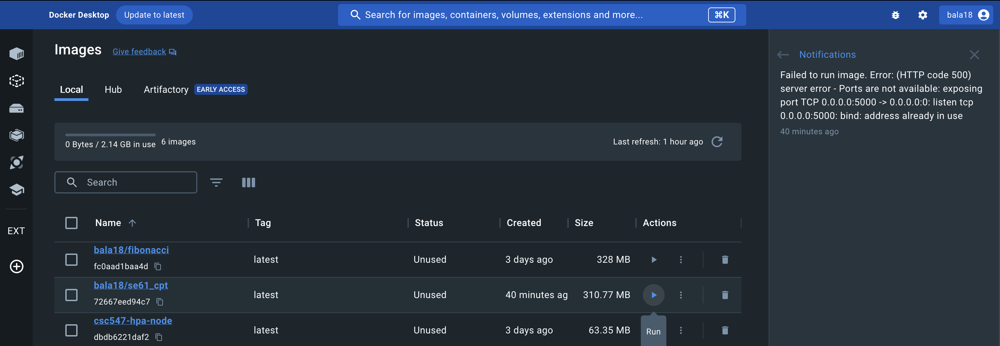
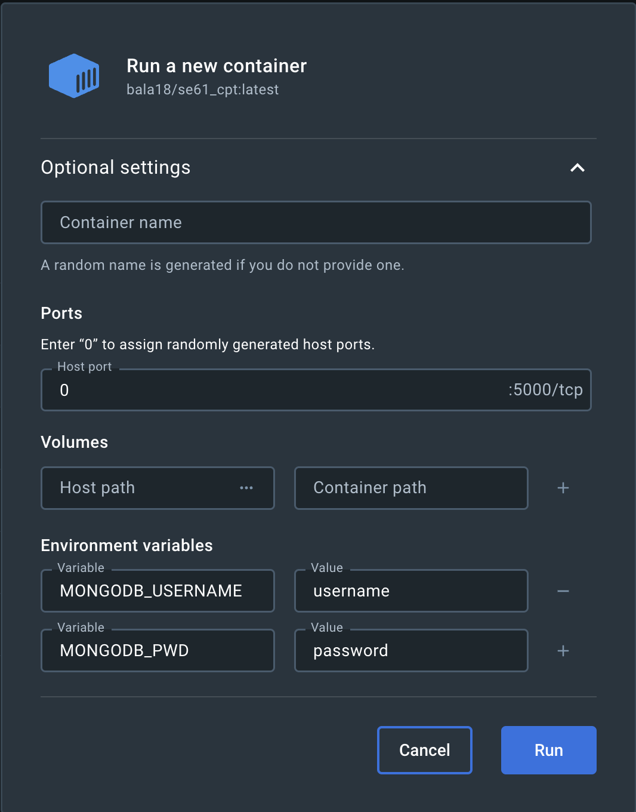
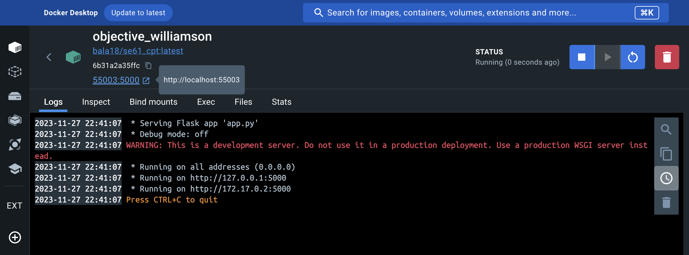
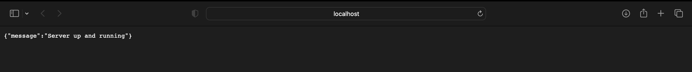

# Docker in our application

We have containerized our backend flask application and have uploaded our docker image in docker hub.

Install docker application using https://docs.docker.com/desktop/

## Creating a docker image

To create a docker file using our backend server folder

- Open the terminal, go to the home page of the project
- Run `docker build -t <docker_image> .` to create the docker image

## Using our docker image from docker hub

- Run the docker application
- Open a terminal and run `docker pull bala18/se61_cpt`, this will pull the docker image from docker hub into your docker application

## Running the docker image

### Step 1

After the docker image is created, click on the run button to start the instance

### Step 2

- Fill 0 for the Ports
- Set MONGODB_USERNAME and MONGODB_PWD (if you are unsure of this read our README)

### Step 3

Once the instance starts running, you can click on the line that says `PORT:PORT` on the top, to open your application in the browser

### Step 3

The browser window opens showing the server is healthy

